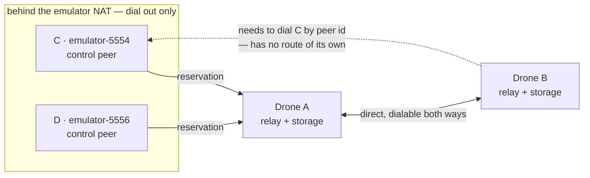
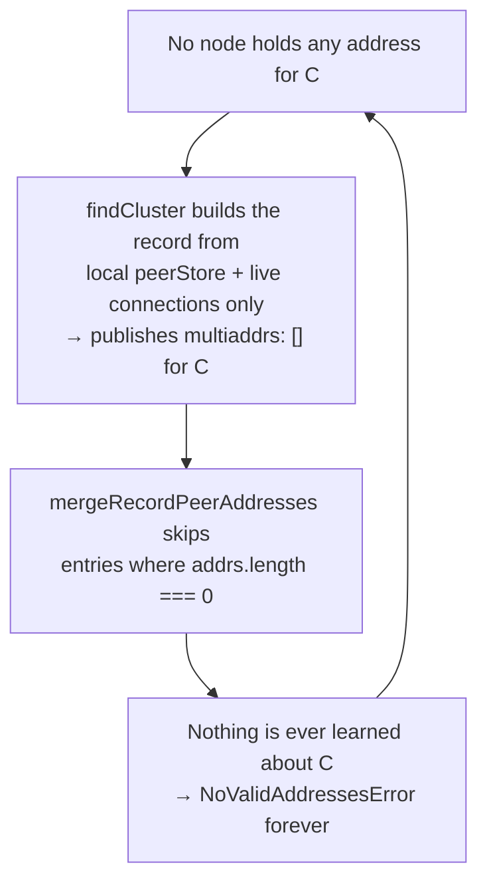
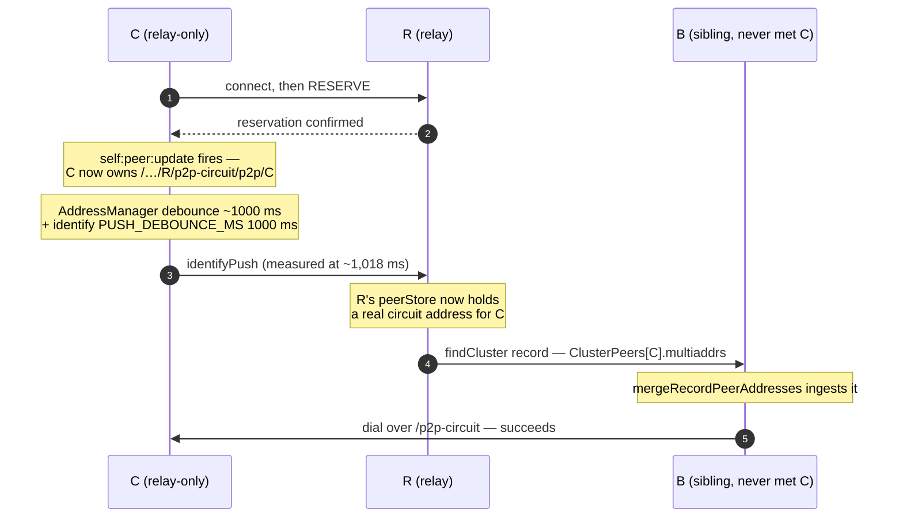
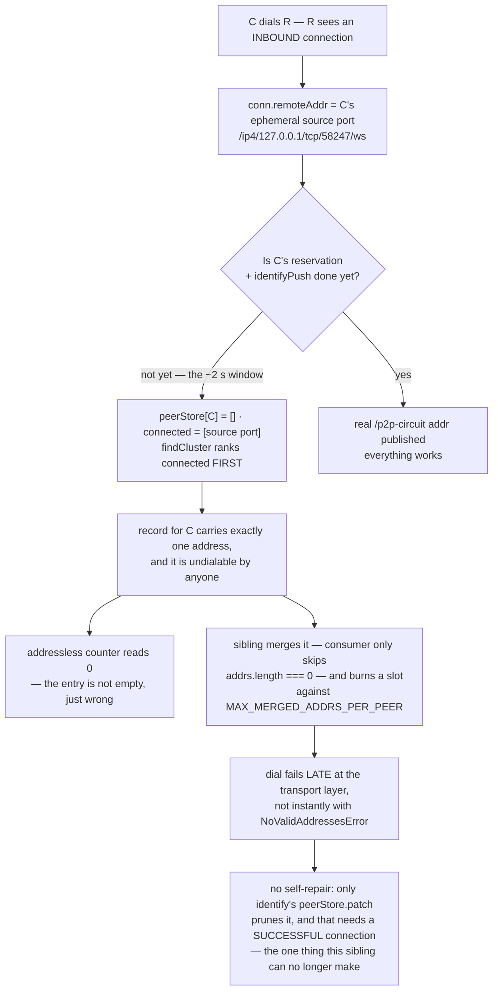
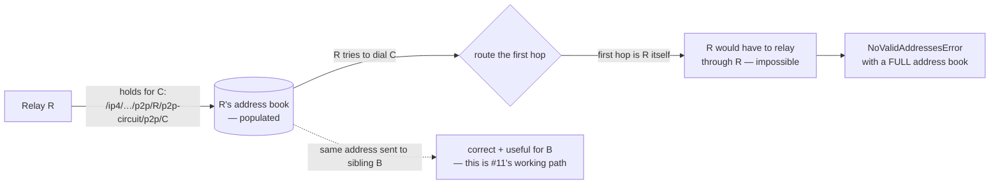

# Optimystic #12 — Debrief

**Repo:** gotchoices/optimystic · **Issue:** #12 · **Opened:** 19 Aug 2026 · **Closed:** 22 Aug 2026 · **Posts:** 5

**Title as filed:** *"A relay-only cohort member can never be taught its first address, so third-party address learning cannot reach the topology it was built for"*

| | |
|---|---|
| **#12** | CLOSED — superseded by #13 and #14 |
| **#13** | accepted, queued for implementation |
| **#14** | accepted, queued behind #13 |
| **#11** | shipped in 0.24.0 — confirmed working |
| **Stack** | `@optimystic/db-p2p 0.24.0` (#13 re-confirmed on 0.24.1) · `@serfab/cadre-core 0.11.0` · `@quereus/quereus 4.14.0` · `p2p-fret 1.0.0-beta.1` · `libp2p 3.x` |

---

## The short version

1. **The filed claim:** nobody can ever introduce the first address of a peer that lives behind a relay, so the address-learning loop is circular and can never start.
2. **Why that was wrong:** `identifyPush` already does exactly that job — it re-announces a peer's addresses *after* its relay reservation completes, which plain `identify` is too early to catch.
3. **What was actually broken:** on an *inbound* connection, `findCluster` publishes the dialer's *ephemeral source port* as if it were the peer's address — and ranks it first. Siblings then learn and cache a guaranteed-dead address. That became issue **#13**.
4. **And a second one:** a relay holds addresses for its reservation holders that route *through the relay itself*, so its own dials fail with a full address book. That became issue **#14**.
5. **Why nobody saw it:** the `addressless` counter counts entries with *zero* addresses. An entry holding one junk address reads as healthy. The instrument was blind in precisely the broken state — an argument **both** parties had leaned on.

---

## 1 · The topology everything happens in

Four nodes. Two Node.js "drones" on a normal network that can dial each other directly and also act as circuit relays. Two Android emulators behind the emulator's NAT, which can dial out but can never be dialled *in* — so each holds a relay reservation and is reachable only as a `/p2p-circuit` address.



**Fig. 1** — A and B are *relay providers*. C and D are *relay-only*: the only way anyone reaches them is a circuit hop through A. B has never touched C, so B can only dial C if somebody hands B a usable address for it. That handover is "third-party address learning", and it is what this whole thread is about.

---

## 2 · Post 01 — what #12 claimed

Optimystic #11, shipped in 0.24.0, had fixed the *consumer* half of address learning: the cluster and repo clients used to throw away addresses that records already carried. After #11, they merge them into the libp2p peerStore.

#12 argued the *producer* half was still missing, and that this made the whole mechanism circular:



**Fig. 2** — The alleged deadlock, as filed. Every participant is in the same position: none has C's address, so none can publish it, so none can learn it. **This diagram is wrong** — it is shown because it is what the issue argued, and the next two sections dismantle it.

The cited root cause, file by file (`@optimystic/db-p2p@0.24.0` dist):

- `libp2p-key-network.js` — `findCluster` composes the record from local knowledge only; `if (parsed.length === 0) addressless.push(...)` counts rather than seeds.
- `libp2p-key-network.js` — `getPeerStoreAddrsByPeer` reads only the local peerStore.
- `peer-address-book.js` — `mergeRecordPeerAddresses`: `if (addrs.length === 0 || idStr === skipId) continue`.
- The only `/p2p-circuit` reference in either module is `isLimitedConnection`, which *classifies* an existing connection; nothing *composes* a circuit address.

The evidence looked strong. Across 46,798 drone log lines, `peer-address-book:merge` fired **zero** times while `findCluster:done` logged 1,389 times from what was assumed to be the same debug namespace.

| Signal | Value |
|---|---|
| `peer-address-book:merge` | **0** |
| `peer-address-book:capped` / `record-capped` | 0 / 0 |
| `findCluster:done` | 1,389 |
| `findCluster:done … peers=4 addressless=0` | 456 |
| `findCluster:addressless-members count=1 of=4` | 6 |
| `NoValidAddressesError` (drone-A) | 41–48 |
| `db-p2p/sync/1.0.0` could-not-negotiate | 2,971 |

The report also shipped a **RED lock** test — a self-contained `node --test` file that *passes* against 0.24.0 by pinning each broken mechanism, so it flips to failing the day a fix lands.

Three suggestions were filed: (1) let a relay-capable node compose `/<relay>/p2p-circuit/p2p/<X>` on the peer's behalf; (2) have the peer contribute its own observed addresses; (3) promote a persistent addressless condition to a warning, since consumers commonly run `:error`-only filters.

---

## 3 · Post 02 — the rebuttal: `identifyPush` is the actor that was supposedly missing

The maintainer verified all four cited mechanisms against the 0.24.0 *source*, not just the shipped `dist`, and confirmed each one. Then pushed back on the framing, because two producer paths already existed.

The key one: **`identifyPush`**. Plain `identify` runs once, when a connection opens — which for a relay-only peer is *before* its reservation completes, so it cannot possibly carry the circuit address. `identifyPush` re-sends on `self:peer:update`, which fires exactly when the reservation adds that address.



**Fig. 3** — The seeding path that #12 said did not exist. Covered by `test/relay-address-propagation.spec.ts` (the #7 regression); `test/relay-third-party-address-gap.spec.ts` already pinned the residual third-party gap as a property of libp2p rather than of db-p2p.

A second point: `findCluster` publishes a node's *own* entry from `libp2p.getMultiaddrs()`, not from the peerStore — and on a relay-only node that set already includes its `/p2p-circuit` address. So the report's **Suggestion 2 was already implemented**.

**Suggestion 1 was rejected** for two reasons beyond the trust boundary (which the maintainer agreed was fine): `@libp2p/circuit-relay-v2` exposes no public reservation store, so composing the address means reaching into private state that can change on any minor bump; and a reservation that has lapsed but not yet been evicted would have the whole cohort dialling the relay for a peer that is no longer there.

The maintainer also gave the discriminator: **at the moment a `NoValidAddressesError` fires for `<C>`, does the dialling node's peerStore hold any address for `<C>`?** Empty → seeding genuinely never happened. Populated → the dial is racing the reservation/push, and the fix is retry-shaped, not seeding-shaped.

---

## 4 · Post 03 — the turn: the retraction, and the thing found underneath

The reporter conceded the core claim — and instead of conceding on paper, built the joined A→B→C→D test the maintainer's own `relay-third-party-address-gap.spec.ts` header had asked for, then re-ran the device topology twice with record contents and dial-failure state instrumented.

The joined test — published 0.24.0 tarball, real loopback sockets, ~2.1 s total:

| Link | Assertion | Result |
|---|---|---|
| A | relay's peerStore gains a `/p2p-circuit` addr via `identifyPush` | pass — ~1,018 ms |
| B | the `ClusterPeers` map `findCluster` publishes carries it | pass — 5 circuit addrs |
| C | a never-connected sibling merges it | pass |
| D | that sibling dials over `/p2p-circuit` | pass — happened unprompted |

Budget at least 20 s for assertion (A): two chained debounces (`AddressManager` ~1000 ms plus identify's `PUSH_DEBOUNCE_MS` 1000 ms).

So the loop was never closed. But the device runs were still failing — and the reason turned out to be one line with no direction check in it.

---

## 5 · Issue #13 — publishing the dialer's source port as the peer's address

`getConnectedAddrsByPeer()` (`libp2p-key-network.ts:839–848`) takes `conn.remoteAddr` from every connection, inbound or outbound. On an **inbound** connection, `remoteAddr` is the dialer's ephemeral source port — a socket that exists only for that one connection and that nobody else in the world can dial. `findCluster` then puts connected addresses *first*, on the reasoning that live connections are the most reliable signal.

```
findCluster:published key=dWtzNUVjM09D peer=12D3KooWCps9
  connected=[ '/ip4/127.0.0.1/tcp/58247/ws/p2p/12D3KooWCps91knz…' ]   <- its ephemeral SOURCE port
  peerStore=[]
  addrs=[ '/ip4/127.0.0.1/tcp/58247/ws/p2p/12D3KooWCps91knz…' ]
```



**Fig. 4** — The window is narrow, but the damage outlives it: the poisoned address is additive in the consumer's book and only a successful connection can replace it. A held-open 20 s observation confirmed no self-recovery. A later settled record does eventually fix things, so this is expensive rather than fatal — but during the window **the record is actively lying rather than merely silent**.

This also explains a symptom change seen across releases: instant no-address failures gave way to 2,971 `db-p2p/sync/1.0.0` failures — i.e. failures moved from pre-dial to the transport layer.

Two device runs (n=4 — two Android emulators behind the emulator NAT, two Node drones providing relay, everything on 0.24.0 / cadre-core 0.11.0):

| Measured on the drones | run 3 | run 4 |
|---|---:|---:|
| records publishing only an ephemeral source socket | 506 | 993 |
| of those, carrying any `/p2p-circuit` address | 0 | 0 |
| records publishing nothing (`addrs=[]`) | 1,428 | 2,366 |
| `peer-address-book:merge` | 0 | 0 |

It is a **lifecycle race**, not a constant. Inside one 30-minute run, same relay and same code, the chain worked for one relay-only peer and essentially never for the other:

| relay-only peer | records published | with an empty peerStore | carrying a circuit addr |
|---|---:|---:|---:|
| emulator-5554 control | 261 | 1 | 260 |
| emulator-5556 control | 1,627 | 1,570 | 57 |

### The fix shape, and why the obvious narrower rule fails

Filter to **outbound** connections — *not* "keep inbound addresses that happen to carry `/p2p-circuit`". The narrower rule looks attractive and does not hold: on a destination peer, `@libp2p/circuit-relay-v2` composes an inbound relayed `remoteAddr` as *our own connection to the relay* + `/p2p-circuit/p2p/<dialer>` (`transport/index.js:272`). If the relay dialled *us*, that base hop is an ephemeral source socket again and the composed address is the same class of garbage, one hop down. The good version of that address already arrives via identify, so the narrow rule buys nothing and reintroduces the bug.

The predicate lands in `peer-address-book.ts` next to `validMultiaddrStrings`, so there is one definition of "an address we are willing to publish to a third party" instead of a permissive copy at each call site. The forcing argument: **a receiving peer has no signal that separates an ephemeral socket from a listen address**, so there is no consumer-side check to add and the producer is the only place a cure can live.

Confirmed unchanged on 0.24.1 (`getConnectedAddrsByPeer` at `:839–848`, connected-first merge at `:956–963`). The joined A/B/C/D test goes in as a regression spec, and the NOTE in `relay-third-party-address-gap.spec.ts` that asked for it gets updated to point at it.

---

## 6 · Issue #14 — a relay dialling its own reservation holders, through itself

The instrumented runs answered the maintainer's discriminating question:

| At `NoValidAddressesError` time | run 3 | run 4 |
|---|---:|---:|
| dial failures | 1,300 | 2,329 |
| with an empty peerStore | 1,299 | 2,283 |
| populated — and *every* address self-relay | 1 of 1 | 44 of 46 |



**Fig. 5** — The same address is *publishable to a third party* and *not dialable by us*. Two deliberately different predicates. All populated-book failures were of this kind, which is why "retry with backoff" is the wrong instinct: **retrying cannot make a self-relay address usable by the node holding it**.

Accepted fix: a cold-path check before the dial.

- If we hold addresses for a peer and **every** one routes through us → fail immediately with a distinct error naming the condition.
- If **any** address does not route through us → dial as today.
- If we hold **nothing** → dial as today, so the genuinely-unknown case is unchanged.
- Detection is a multiaddr-component check against our own peer id, **not** a substring match.

Deliberately *not* doing: no retry/backoff on this path, and no attempt to have the relay re-establish reachability to a reservation holder whose connection dropped — only the client can re-initiate. Failing fast lets the caller's existing exclude-and-continue logic move to another cohort member instead of burning a dial timeout. The self-relay address is still published to siblings, because it is correct and useful for them (#11's working path).

The failures also were not where #12 aimed. By protocol: **1,287 of 1,300 on `db-p2p/sync/1.0.0`**, 12 on `block-transfer`, 1 on `repo` — barely any on `findCluster`'s own dials.

---

## 7 · Post 04 — the counter that read clean in exactly the broken state

Both sides had leaned on the `addressless` counter. The maintainer's §3 argument was that 456 of 1,389 lookups reported `peers=4 addressless=0`, so *something* must be seeding addresses successfully.

> **Withdrawn by the maintainer.** `addressless` counts entries with **zero parsed addresses**. An entry holding one ephemeral source socket is not zero. So the counter reads clean in precisely the state that is broken — and `findCluster:addressless-members` never fires while every dial fails. The argument was reading an instrument that could not have reported the failure.

The consequence worth stating plainly: **fixing #13 repairs the counter as a side effect.** Once inbound `remoteAddr` stops being published, an inbound-only peer with an empty peerStore yields an empty address list, `addressless` increments, and the existing log line fires during exactly the window being measured. No new diagnostic is needed — the existing one becomes trustworthy, which is why it is now pinned by tests rather than left as a log line.

### The one measurement that survived intact

`peer-address-book:merge` at 0 — re-run across 110,992 + 177,320 lines on the two drones with *both* namespaces armed, and 0 again on a second run. But it is not evidence about the merge sites at all: **a merge happens on record *ingest*, and the dials that would carry a record fail before any record is exchanged. The loop closes at the dial, not at an empty record.**

### Tracked separately — the namespace split

The same `peer-address-book:merge` text is emitted under two unrelated DEBUG namespaces:

- inbound sink — `ClusterService.learnPeerAddresses` → `db-p2p:peer-address-book` (libp2p's `defaultLogger().forComponent(name)` adds **no** prefix)
- outbound path — `ClusterClient` / `keyNetwork.recordPeerAddresses` → `optimystic:db-p2p:libp2p-key-network:<peer>`

A single-namespace grep is half-blind — and this is the channel users are told to enable when diagnosing this exact area. Use `DEBUG=optimystic:db-p2p:*,db-p2p:*`. Tracked on the maintainer's side alongside #13 and #14 rather than filed separately.

---

## 8 · Post 05 — disposition

| | |
|---|---|
| **#12** | Closed in favour of #13 and #14. The producer-side gap it describes does not exist; what its measurements were actually recording is #13. |
| **#13** | Accepted, queued for implementation. Confirmed against 0.24.1. Reporter's joined test goes in as a regression spec. |
| **#14** | Accepted, queued behind #13 — shares a file and a predicate. |
| **#11** | Shipped in 0.24.0, re-confirmed working by the joined test. |
| **Namespace split** | Tracked in the same batch; not filed separately at the maintainer's request. |

### One loose end explained, not papered over

Device runs showed `NoValidAddressesError`; the loopback repro showed an `AggregateError` of *Can not dial self*. libp2p's dial queue explains it: in `calculateMultiaddrs` (`libp2p/dist/src/connection-manager/dial-queue.js:253`), candidates are filtered by `dialTransportForMultiaddr(...) == null` before anything is attempted. If that empties the set you get `NoValidAddressesError` with a populated address book and zero dial attempts; if candidates survive the filter, each is attempted and fails individually, which aggregates. The discriminator is whether the circuit transport is registered as a *dialer* on that node. **Practical upshot: treat the error name as environment-dependent and the self-relay address book as the reliable signal.**

---

## Appendix A · The low-end-device detour that is not part of the bug

Posted as a reproduction warning: on a Redmi 8 (Android 10, API 29, arm64-v8a) the circuit-relay **reservation itself** never completes, dying at startup with:

```
UnsupportedListenAddressesError: Some configured addresses failed to be listened on …
  /ip4/<host>/tcp/<port>/ws/p2p/<relay>/p2p-circuit: AbortError: The operation was aborted
failed to upgrade outbound connection … TypeError: Cannot read property 'message' of undefined
```

It looks like a network or config fault. It is not.

```
event-loop lag monitor — 100 ms setInterval measuring its own lag
  STALL lag=5973ms      <- logged in the same millisecond as "websockets connected +6s"
  STALL lag=14714ms
  ...after boot: heartbeat 1002 ms against a 1000 ms interval — thread is healthy
```

The socket connected promptly; the *callback could not be serviced*, because the app's own storage-layer boot work was blocking the JS main thread. Deferring that work off the reservation's critical path made the reservation complete on the same device, first try (`making reservation` → `requesting reservation` → `created reservation` → `relay peer added`, confirmed relay-side). Emulators complete the whole reservation in ~1.2 s and never enter the state, which is why the topology in the main report forms normally there.

Three things worth carrying forward:

- **That `TypeError` masks the real error.** It appears in libp2p's upgrader error path (`libp2p/dist/src/upgrader.js` logs the caught error with `%e`) and the value being unwrapped is literally `undefined` — a sibling line reads `bootstrap:error could not dial bootstrap peer <id> - undefined`. The visible error points nowhere near the cause.
- **Raising timeouts is a dead end.** `listenTimeout`, `reservationCompletionTimeout`, `connectionManager.dialTimeout`, `inboundUpgradeTimeout` — all 5–10 s → 60 s, one at a time, each verified in the actually-served bundle. The abort stayed pinned at ~10 s every time. A blocked thread cannot run the handshake *or* the timer that would extend it.
- **`connectionManager` options passed through `createLibp2pNode` are silently dropped** — `libp2p-node-base.js` hardcodes that block and forwards only `connectionGater`. The first `dialTimeout` test looked like a clean negative and was not.

---

## Appendix B · Claims ledger

### Refuted / withdrawn

| Source | Claim | Verdict |
|---|---|---|
| #12 · reporter | A relay-only peer's first address can never be introduced, so the learning path is circular. | **Refuted** — `identifyPush` is the intended seeder, and the reporter's own joined test proved all four links pass in ~2.1 s. |
| #12 · suggestion 2 | Have the peer contribute its own observed addresses. | **Already implemented** — `findCluster` publishes the self entry from `libp2p.getMultiaddrs()`, which on a relay-only node includes the circuit address. |
| #12 · suggestion 1 | Let a relay-capable node compose `/<relay>/p2p-circuit/p2p/<X>` on the peer's behalf. | **Rejected** — no public reservation store in `@libp2p/circuit-relay-v2`, and a lapsed-but-unevicted reservation would have the cohort dialling a relay for a peer that is gone. |
| Maintainer · §3 | 456 lookups with `addressless=0` show seeding works, so this is a residual race not an unreachable state. | **Withdrawn** — the counter includes live-connection addresses, so it reads 0 exactly in the case that is broken. |
| #12 · evidence | 0 merges in 46,798 lines proves the merge is inert. | **Reframed** — re-verified at 0 across both namespaces, but merges happen on record *ingest* and the dials that carry records fail first. Says nothing about the merge sites. |

### Stands

| Source | Claim | Verdict |
|---|---|---|
| #12 · suggestion 3 | A persistent addressless condition should be promoted to a warning, since consumers commonly run `:error`-only filters. | **Stands** — and the #13 fix makes the existing counter trustworthy, so the diagnostic becomes real rather than new. |
| Reporter · ruled out | It is not the connection gater. Every branch of the membership admission predicate was instrumented: zero invocations, zero denials relay-side. | **Stands** — and `NoValidAddressesError` is a pre-dial failure anyway, so a gate cannot produce it. |
| Reporter · ruled out | Reservations are fine — `relayReservation=true` on both relay-only peers in both runs, circuit addresses visible on the peers themselves. | **Stands** — which forces the defect upstream into *what gets published*, rather than into whether the address exists. |

---

## Appendix C · Jargon, decoded

### libp2p primitives

**libp2p** — The modular peer-to-peer networking stack this all runs on. Provides transports, peer identity, discovery, and protocol multiplexing; Optimystic builds its database layer on top.

**multiaddr** — A self-describing address, e.g. `/ip4/127.0.0.1/tcp/58247/ws/p2p/12D3Koo…`. Each `/segment` names one layer. Because it is composable, a relayed address is literally *a path to the relay* + `/p2p-circuit/p2p/` + *the destination peer id* — which is why a bad first hop poisons the whole address.

**PeerId** — A peer's cryptographic identity (the `12D3Koo…` string), derived from its public key. Stable across addresses — you dial "this peer", and libp2p figures out which address to use.

**peerStore** — libp2p's local address book: peer id → known addresses, protocols, keys. "Empty peerStore" here means *we know who the peer is but not where it is*.

**identify / identifyPush** — `identify` runs once when a connection opens and exchanges each side's advertised addresses. `identifyPush` re-sends them later when they change (on `self:peer:update`). The distinction is the whole rebuttal: a relay reservation completes *after* the connection opened, so only the push can carry the resulting circuit address.

**circuit relay v2 · reservation** — How an undialable peer stays reachable. It asks a public node to hold a *reservation*, after which anyone can reach it at `/…/<relay>/p2p-circuit/p2p/<peer>` and the relay forwards the bytes.

**relay-only peer** — A peer behind NAT with no dialable listen address of its own. Every inbound connection to it must go over a circuit. Both Android emulators here are relay-only.

**inbound vs outbound · `remoteAddr`** — On an *outbound* connection, `remoteAddr` is the address you deliberately dialled — reusable. On an *inbound* one it is the peer's **ephemeral source port**: an OS-assigned port that exists only for that connection and is meaningless to anyone else. #13 is the absence of this distinction.

**DialQueue · `calculateMultiaddrs`** — libp2p's dial machinery. It first filters candidate addresses to those with a registered transport; if that empties the list you get `NoValidAddressesError` with no dial attempted, otherwise each survivor is tried and failures aggregate.

**`NoValidAddressesError`** — "The dial request has no valid addresses for peer X." Ambiguous: it means either *we hold nothing* or *nothing we hold is dialable by us* — #14 is the second case, and disambiguating it is the accepted fix.

**upgrader** — The layer that turns a raw socket into a secured, muxed libp2p connection. The Redmi 8 detour's misleading `TypeError` comes from its error path logging an `undefined` value.

**connectionGater** — A set of hooks that can veto connections. VoteTorrent's control nodes wrap it in a membership admission gate; it was a prime suspect here and was instrumented out.

**`PUSH_DEBOUNCE_MS` · AddressManager debounce** — Two ~1000 ms delays chained in the seeding path — the address manager settles before identify pushes. Together they set the ~2 s window in which the defect lives, and the ~20 s budget the regression test needs.

### Optimystic / db-p2p

**Optimystic · `@optimystic/db-p2p`** — The distributed-database layer under VoteTorrent. `db-p2p` is the libp2p-backed package where every file in this thread lives.

**cluster · cohort** — The set of peers responsible for a given key. *Cohort member* = one of them. Consensus for a key needs its cohort to be mutually reachable — which is why one undialable member is a real outage, not cosmetic.

**`findCluster`** — Resolves a key to its cohort and publishes a record describing each member — peer id, public key, and `multiaddrs`. It is the *producer* of third-party address knowledge, and the source of the defect.

**third-party address learning** — Learning where peer C is from peer R, without ever having talked to C. The only way a cohort forms across NAT. #11 fixed the consumer half; #12 wrongly claimed the producer half was missing; #13 is the producer half being *wrong* rather than absent.

**ClusterService · ClusterClient · RepoClient** — The ingest points where records and redirect payloads arrive. Before #11 they discarded the addresses those payloads carried. `ClusterService` is the *inbound* sink; `ClusterClient`/`RepoClient` the *outbound* reply path — and they log under different namespaces.

**peer-address-book · `mergeRecordPeerAddresses`** — Where learned addresses enter the local peerStore. Its only rejection rule is `addrs.length === 0`, so it cannot tell a junk address from a good one — the reason the cure has to live in the producer.

**`MAX_MERGED_ADDRS_PER_PEER`** — A cap on merged addresses per peer. Because merges are additive, a poisoned address does not just fail — it occupies a slot a real address might have needed.

**`addressless` · `findCluster:addressless-members`** — The counter of cohort entries with zero addresses, and the only direct read-out on whether this mechanism works. It counts *empty*, not *useless* — so it read clean throughout the failure. Both parties built an argument on it and both withdrew.

**`db-p2p/sync/1.0.0` · `block-transfer` · `repo`** — The protocol names carrying the actual work. 1,287 of 1,300 dial failures were on `sync`, not on findCluster's own dials — the volume was never where #12 aimed.

**self-relay address** — An address for peer C whose relay hop is *you*. Correct and useful to publish to a sibling; useless to dial yourself, since you cannot relay through yourself. #14 in one line.

### VoteTorrent-side terms and method

**control node vs strand node** — Two node roles in `@serfab/cadre-core`. The asymmetry that made the bug legible: strand peer ids carried real circuit addresses in the same run where control peer ids carried none.

**drone** — A Node.js process in the test harness playing a fixed infrastructure role — here, relay provider and storage node.

**transaction-profile node** — An Optimystic node profile that participates in transactions without providing storage or relay — the profile the emulators run.

**RED lock test** — A test that *passes while the bug exists*, because each assertion pins a currently-broken mechanism. It flips to failing the day a fix lands — turning "did anything change upstream?" into a CI signal rather than a re-investigation.

**DEBUG namespace** — The `debug` library's filter, e.g. `DEBUG=optimystic:db-p2p:*`. Under an `:error`-only filter, a healthy node and a totally inert address book look identical — and the two halves of the merge log under unrelated namespaces, so a single filter is half-blind.

**event-loop stall** — JS is single-threaded: blocking work starves every pending callback and timer. A 100 ms interval measuring its own lag detects it — 5,973 ms and 14,714 ms here, which is why raising timeouts could not help.

---

*Sources: gotchoices/optimystic issue #12 (opened 19 Aug 2026, closed 22 Aug 2026, 5 posts), with companion issues #11, #13, #14.*
