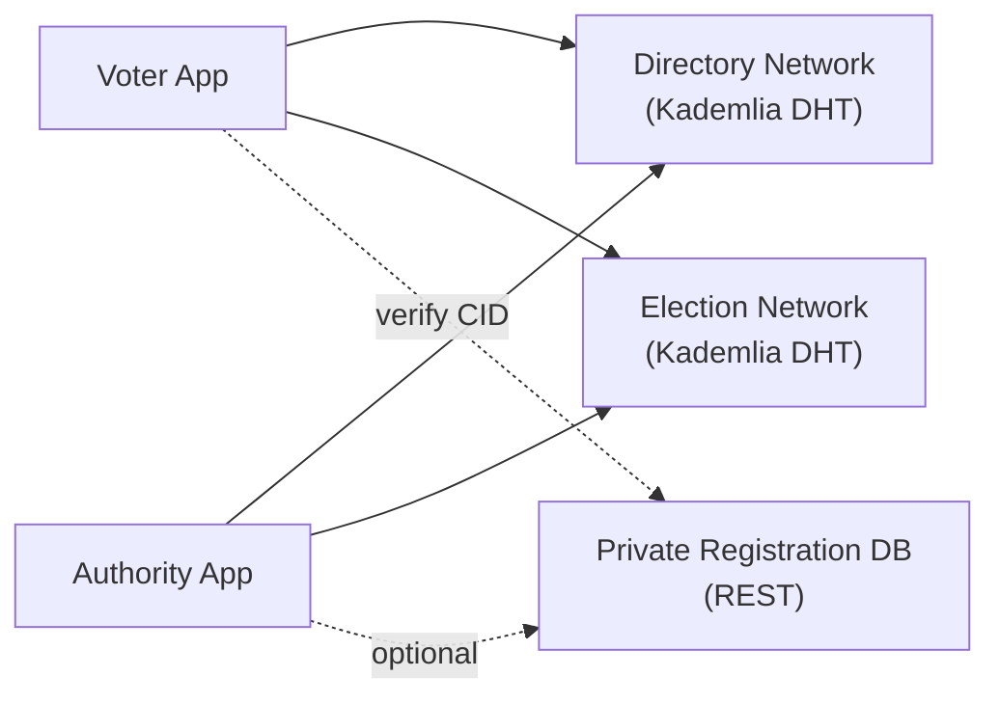
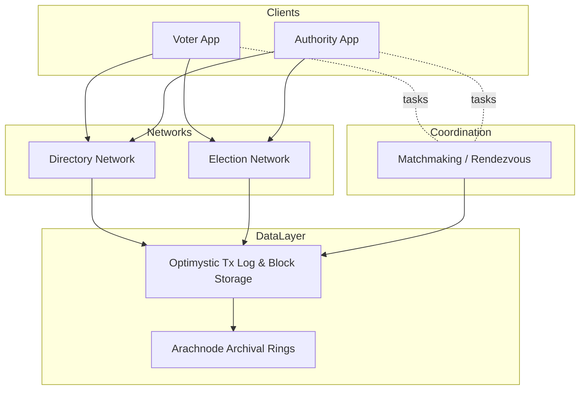
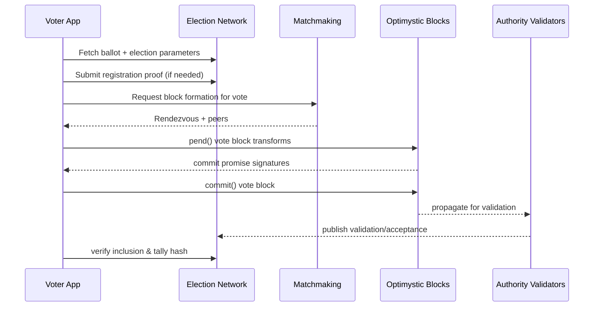

# VoteTorrent Technical Lead Overview

This document summarizes the core concepts, components, and architecture of the VoteTorrent platform for technical leads. It complements the detailed specs in `doc/` and adds two Mermaid diagrams for quick discussion.

## Essential Concepts
- **Two Kademlia-based networks**: a global Directory Network for authority discovery and per-election Election Networks for ballots, votes, and validation data.
- **Optimystic distributed DB**: logical transaction log with block storage and multi-phase commit across peers for ACID-like guarantees on a DHT.
- **Matchmaking layer**: rendezvous-key based peer coordination to form voting blocks, validation groups, and workload distribution.
- **Roles and trust**: Administrations sign actions with scoped privileges; multi-sig style thresholds per operation; registrants hold keypairs (ideally in HSM/secure enclave).
- **Data artifacts**: elections, ballot templates, registrations, votes, validation proofs, and checkpoints—always signed and verifiable from the network.
- **Privacy model**: scrambled block formation and separation of registration vs vote data; private voter attributes can live off-network with CID linkage.

## Component Overview
- **Directory Network**: Kademlia DHT storing authority records and election network references (long-lived, global).
- **Election Network**: Kademlia DHT per election/district storing election config, ballots, registrations, votes, validation outcomes (time-bounded).
- **Voter App**: mobile client for registration, ballot fetch, vote casting, and verification; connects to both networks.
- **Authority App**: mobile/desktop client for administrators to manage elections, ballot templates, and keys; connects to both networks.
- **Private Registration DB (optional)**: authority-hosted API holding sensitive voter data; network stores only hashed/CID references.

## Architectural Overview
- **Network layer**: libp2p + Kademlia DHT for peer routing, content addressing, and block replication.
- **Data layer (Optimystic)**: transaction logs, block storage, checkpoints, optional archival via Arachnode rings.
- **Coordination layer (Matchmaking)**: rendezvous keys for forming voting/validation blocks and workload assignment.
- **Application services**: registration, election lifecycle, ballot templates, vote casting, validation, results certification.
- **Clients**: Voter and Authority apps using secure keys, signatures, and hardware enclaves where possible.

## Data & Process Flows
### Vote lifecycle (happy path)

### Administrative actions
- Admin signatures are scoped (claims) and thresholded per operation.
- Actions include: election creation, ballot template updates, authority invites, registration approvals, peer configuration.
- The Directory Network anchors trust by encoding the primary authority’s SID in protocol constants.

## Security & Trust Highlights
- All records (elections, ballots, registrations, votes, validations) are signed; mutations require appropriate scoped signatures.
- Hardware-backed keys for administrators and ideally voters; device associations can be auto-approved by authority peers.
- Time-bounded TTLs and gossip ensure in-doubt transactions converge to success/failure.
- Separation of concerns: optional private DB holds sensitive attributes; network holds hashed/CID references.

## Discussion Checklist for Technical Leads
1) Network health: peer density, bucket balance, rendezvous key specificity tuning.
2) Data durability: checkpoint cadence, archival policy (Arachnode ring placement), GC horizons.
3) Security posture: key custody, HSM enforcement, signature thresholds, SID bootstrap integrity.
4) Performance: block formation latency, matchmaking TTLs, tail-block hotspot mitigation.
5) Operational readiness: monitoring for pending/conditional transactions, log tail divergence, rollback/compensation paths.
6) Compliance/privacy: handling of private registration data, consent, auditability of validation and tally.

## Pointers to Detailed Specs
- Subsystems & glossary: `doc/architecture.md`
- Transactions & storage: `doc/optimystic.md`
- Matchmaking: `doc/matchmaking.md`
- Election processes: `doc/election.md`
- Administration & trust: `doc/administration.md`
- Archival storage: `doc/arachnode.md`
